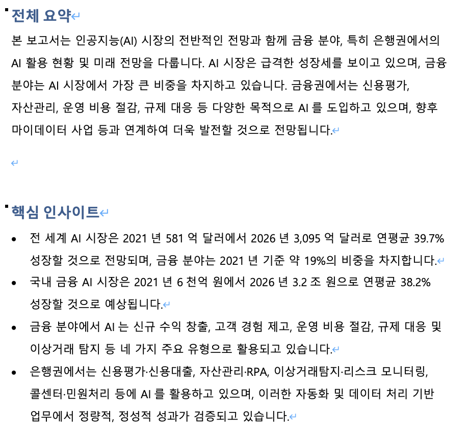
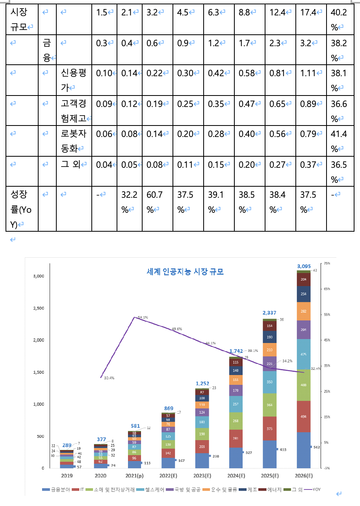
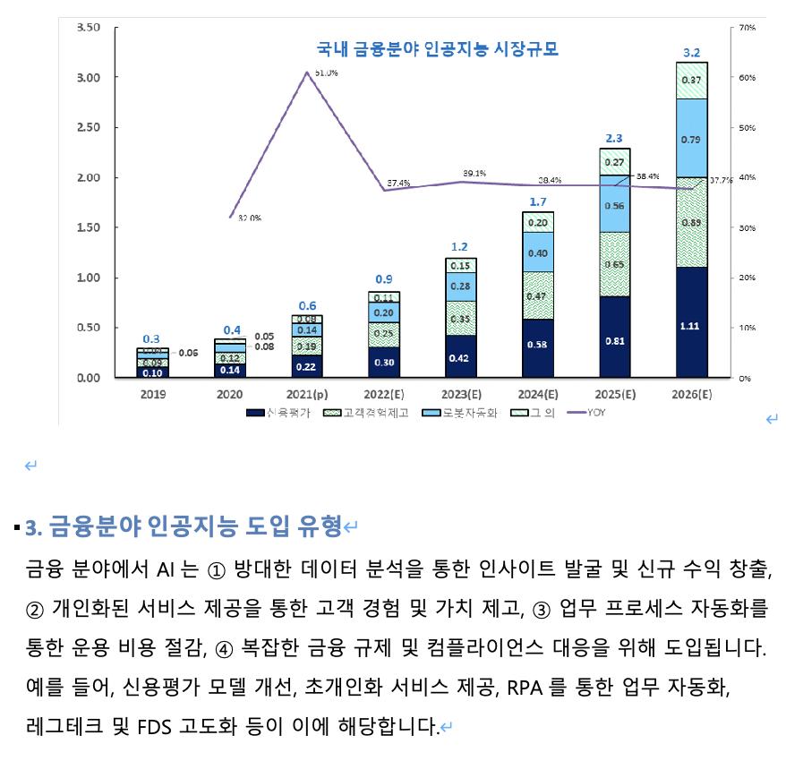

# PDF Analyzer

어떤 PDF 문서든 분석하여 한국어 분석 리포트(docx)를 생성하는 범용 도구입니다.

Gemini API를 사용해 문서 유형을 자동 감지하고, 전체 요약, 핵심 인사이트, 섹션별 분석을 수행합니다.
PDF 내 테이블과 이미지는 원본 그대로 결과물에 삽입됩니다.

## 출력 결과물 구성

- **문서 유형**: 자동 감지 (리서치 리포트, 학술 논문, 기술 문서, 사업 계획서 등)
- **전체 요약**: 3~5줄 핵심 요약
- **핵심 인사이트**: 문서 유형에 맞는 중요 수치·결론·주장
- **섹션별 분석**: LLM 분석 줄글 + 원본 테이블 + 원본 이미지

## 요구사항

- Python 3.10+
- Java 11+ (`brew install openjdk@17` on macOS)
- Gemini API Key ([Google AI Studio](https://aistudio.google.com/app/apikey)에서 발급)

## 설치

```bash
# Java 설치 (macOS)
brew install openjdk@17
echo 'export PATH="/opt/homebrew/opt/openjdk@17/bin:$PATH"' >> ~/.zshrc
source ~/.zshrc

# Python 환경
python -m venv venv
source venv/bin/activate  # Windows: venv\Scripts\activate
pip install -r requirements.txt
```

## 환경 설정

```bash
cp .env.example .env
# .env 파일에 GEMINI_API_KEY 입력
```

## 사용법

### 로컬 실행

```bash
python main.py input.pdf
python main.py input.pdf -o output/result.docx
python main.py input.pdf --model gemini-2.5-flash
```

결과물은 `output/파일명_분석_YYYYMMDD.docx`에 저장됩니다.

### Docker 실행

```bash
# 이미지 빌드
docker build -t pdf-analyzer .

# 실행
docker run --rm \
  -e GEMINI_API_KEY=your_api_key \
  -v /path/to/input.pdf:/input/input.pdf \
  -v /path/to/output:/app/output \
  pdf-analyzer /input/input.pdf
```

## 프로젝트 구조

```
pdf-analyzer/
├── main.py              # 진입점
├── src/
│   ├── pdf_extractor.py # opendataloader-pdf 기반 추출 (텍스트/테이블/이미지)
│   ├── llm_analyzer.py  # Gemini API 범용 분석
│   └── docx_writer.py   # docx 생성 (테이블/이미지 렌더링 포함)
├── Dockerfile
├── requirements.txt
└── .env.example
```

## 결과 예시





## 샘플

`examples/` 폴더에 샘플 입력과 결과물이 있습니다.

| 파일 | 설명 |
|---|---|
| `examples/sample_input.pdf` | 샘플 입력 PDF (AI 금융 활용 리서치 리포트) |
| `examples/sample_output.docx` | 생성된 한국어 분석 리포트 |
